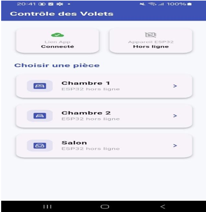
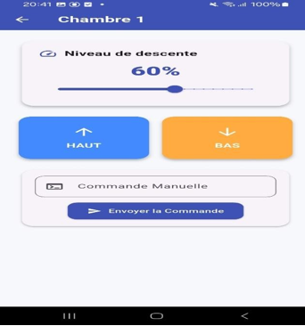

# Smart Roller Shutter Control System
### IoT-Based Remote Control via MQTT & Flutter

<div align="center">


> **Academic Project** — École Nationale d'Électronique et des Télécommunications de Sfax (ENET'Com)  
> Department of Industrial Computer Engineering (GII) | Academic Year 2025/2026

</div>

---

## Table of Contents

1. [Project Overview](#project-overview)
2. [Team & Contributions](#team--contributions)
3. [System Architecture](#system-architecture)
4. [Flutter Application](#flutter-application)
5. [ESP32 Firmware](#esp32-firmware)
6. [Hardware Design](#hardware-design)
7. [Test Results](#test-results)
8. [How to Run](#how-to-run)
9. [Calibration Model](#calibration-model)
10. [Future Improvements](#future-improvements)
11. [References](#references)

---

## Project Overview

This project implements a full-stack IoT system for remotely controlling roller shutters via a smartphone application. It demonstrates a complete end-to-end pipeline covering mobile development, embedded firmware, and MQTT-based communication — all within a real Smart Home context.

The system enables users to:

- Open and close roller shutters per room from a Flutter mobile application
- Set a precise opening percentage (0–100%) using an interactive slider
- Monitor ESP32 connectivity status in real time
- Fall back to physical buttons for local manual control when network is unavailable

---

## Team & Contributions

> This was a collaborative university project. The work was divided across four team members according to each member's area of expertise.

| Member | Role |
|---|---|
| **Rayen Abid** | Flutter Mobile Application — MQTT client integration, UI/UX design, state management, command publishing, and error handling |
| **Taher Bouderbela** | Hardware integration and prototyping |
| **Sadek Dhokar** | ESP32 firmware development and MQTT backend logic |
| **Arbi Mnasria** | System architecture design and test validation |

> **Individual contribution:** My work focused entirely on the Flutter mobile application, covering MQTT broker connection, real-time status display, room selection interface, directional control buttons (UP/DOWN), percentage slider, manual command input field, and robust error handling via SnackBar notifications.

---

## System Architecture
+-------------------+        MQTT Broker        +-------------------+
|                   | --- broker.hivemq.com --- |                   |
|    Flutter App    |                           |       ESP32       |
|                   |   publish -> esp32/room1  |                   |
|    [PUBLISHER]    |   publish -> esp32/room2 --->|    [SUBSCRIBER]   |
|    [SUBSCRIBER]   |   publish -> esp32/room3  |    [PUBLISHER]    |
|                   |                           |                   |
| subscribe <-------+------ esp32/status -------+  retained: online |
+-------------------+                           +---------+---------+
                                                          |          
                                                +---------v---------+
                                                |    GPIO Outputs   |
                                                | Room 1: A=26 B=27 |
                                                | Room 2: A=25 B=33 |
                                                | Room 3: A=32 B=14 |
                                                +-------------------+
### MQTT Topic Map

| Topic | Direction | Payload |
|---|---|---|
| `esp32/room1` | App -> ESP32 | `up` / `down` / `0..100` |
| `esp32/room2` | App -> ESP32 | `up` / `down` / `0..100` |
| `esp32/room3` | App -> ESP32 | `up` / `down` / `0..100` |
| `esp32/status` | ESP32 -> App | `online` / `offline` |

---

## Flutter Application

> This section covers my direct contribution to the project.

### User Interface Showcase

<p align="center">
  
  &nbsp;&nbsp;&nbsp;&nbsp;
  
</p>

### Project Structure
lib/
├── main.dart        # Application entry point — MaterialApp bootstrap
├── home_page.dart   # MQTT connection, ESP32 status display, room list
├── room_page.dart   # Room control: UP/DOWN buttons, slider, manual input
└── mqttpage.dart    # MQTT debug and test page
### MQTT Connection

Implemented in `home_page.dart` using the `mqtt_client` package (v10.0.0):

```dart
client = MqttServerClient(
  broker,
  'flutter_${DateTime.now().millisecondsSinceEpoch}',
);
client.port = 1883;
client.keepAlivePeriod = 20;
client.connectionMessage = MqttConnectMessage()
    .withClientIdentifier(client.clientIdentifier)
    .startClean();

await client.connect();
setState(() => status = "Connecté");

client.subscribe(statusTopic, MqttQos.atLeastOnce);
Connection parameters:

Broker: broker.hivemq.com

Port: 1883

Keep-alive: 20 seconds

Session mode: clean session

QoS: atLeastOnce

On successful connection, the app subscribes to esp32/status and displays either "En ligne" or "Hors ligne" based on the retained message published by the ESP32.

Command Publishing
Implemented in room_page.dart. The app publishes plain-text payloads to the topic corresponding to the selected room (esp32/roomX):
void _sendMqttMessage(String message) {
  if (widget.client.connectionStatus?.state != MqttConnectionState.connected) {
    ScaffoldMessenger.of(context).showSnackBar(
      const SnackBar(content: Text("Non connecté au serveur MQTT")),
    );
    return;
  }
  final builder = MqttClientPayloadBuilder();
  builder.addString(message);
  widget.client.publishMessage(widget.topic, MqttQos.atLeastOnce, builder.payload!);
}
User ActionPublished PayloadPress HAUT button"up"Press BAS button"down"Release slider at N%"N" (string, sent on onChangeEnd)Submit manual fieldCustom string inputError HandlingBefore every publish call,
 the app verifies the MQTT connection state. If the broker is unreachable, a SnackBar is displayed with the message "Non connecté au serveur MQTT", preventing ghost commands from being silently dropped.ESP32 FirmwareDeveloped by the embedded team using PlatformIO and C++. Source: tryingmqtt/src/main.cpp
Wi-Fi Connection
WiFi.begin(ssid, password);
while (WiFi.status() != WL_CONNECTED) {
  delay(500);
  Serial.print(".");
}
Serial.println("WiFi Connected!");
MQTT Connection and Last WillThe firmware uses the PubSubClient library. A Last Will message is registered on esp32/status:On unexpected disconnection: publishes "offline"On successful connection: publishes "online" with the retained flag setThis ensures the Flutter app always reflects the true state of the device, even after a cold start.Bidirectional Motor ControlEach room is driven by two GPIO output pins (A and B):CommandPin APin BupHIGHLOWdownLOWHIGHStopLOWLOWPercentage-to-Duration Conversion
int moveTime = map(val, 0, 100, 0, 10000);
// Activate direction
digitalWrite(pinA, HIGH);
digitalWrite(pinB, LOW);
digitalWrite(LED_PIN, HIGH);
delay(moveTime);
// Stop
digitalWrite(pinA, LOW);
digitalWrite(pinB, LOW);
digitalWrite(LED_PIN, OFF);
Manual Fallback Buttons
Pin,Action
18,Room 1 — UP
19,Room 1 — DOWN
Configured as INPUT_PULLUP. Detection on HIGH-to-LOW edge transition. A delay(3000) debounce prevents repeated triggers.

Hardware Design
Microcontroller
The target controller used in this system is an ESP32-WROOM-32U board.

Breadboard Setup & Prototyping
Physical breadboard prototype demonstrating driver wiring, relay/LED indicators, and push button inputs.

Components
Component,Purpose
ESP32,Core embedded microcontroller
LEDs + Resistors,Motor load simulation for prototype testing
Push Buttons,Local manual fallback control
Breadboard + Jumper Wires,Rapid prototyping
USB Cable,Power supply (prototype)
GPIO Pin Mapping
Room,Pin A,Pin B,LED,Button UP,Button DOWN
Chambre 1,26,27,17,18,19
Chambre 2,25,33,—,—,—
Salon,32,14,—,—,—
Safety note: In a production environment, simultaneous activation of opposing directions (A=HIGH, B=HIGH) must be prevented at the hardware level to avoid short-circuit conditions in H-bridge or relay-based drivers.

Test Results
Verification & Hardware Logs
Test Matrix
#,Test Description,Expected Result,Status
1,ESP32 firmware compilation and upload via PlatformIO,Build and upload success,PASS
2,ESP32 Wi-Fi connection,"Serial output: ""WiFi Connected!""",PASS
3,MQTT broker connection and topic subscription,"Serial output: ""Connecting to MQTT...connected""",PASS
4,Flutter app MQTT connection and ESP32 status display,"App: ""Connecté"" / ESP32: ""En ligne""",PASS
5,UP/DOWN command propagation: App -> MQTT -> ESP32 -> GPIO,"Serial logs: ""Room 1 | UP"" and ""Room 1 | DOWN""",PASS
6,Percentage slider command (65% -> ~6.5s motor duration),LED17 ON for ~6.5s then OFF,PASS
7,Manual button fallback (pin 18 / pin 19),Physical control without app,PASS
How to Run
Flutter Application
# Clone the repository
git clone [https://github.com/yourusername/smart-roller-shutter.git](https://github.com/yourusername/smart-roller-shutter.git)

# Navigate to the Flutter project
cd flutter_app

# Install dependencies
flutter pub get

# Run on a connected Android or iOS device
flutter run
Required dependency in pubspec.yaml:
dependencies:
  flutter:
    sdk: flutter
  mqtt_client: ^10.0.0
ESP32 Firmware
# Open the firmware project in VS Code with PlatformIO extension
cd esp32_firmware

# Build and upload
pio run --target upload

# Open serial monitor at 115200 baud
pio device monitor --baud 115200
Calibration Model
The system uses a time-based approximation to translate a percentage command into a physical shutter movement:
move_time (ms) = (target_percentage / 100) * 10000
This assumes that a full open/close cycle (0% to 100%) takes exactly 10 seconds of motor operation. For a production system, this approximation should be replaced with closed-loop feedback using limit switches or position encoders.

Future Improvements
Replace blocking delay() calls with non-blocking millis() logic to maintain MQTT loop responsiveness during motor actuation

Implement real position feedback using limit switches or motor current sensing

Secure broker communication using TLS encryption and credential-based authentication

Remove hardcoded Wi-Fi credentials and use a provisioning mechanism (e.g., BLE setup or captive portal)

Deploy a local MQTT broker (Mosquitto on Raspberry Pi) for fully offline operation

Extend the Flutter app with scheduling, automation scenes, and multi-room batch control

Add dynamic room configuration rather than hardcoded room definitions

References
Flutter Documentation

mqtt_client — pub.dev

MQTT Protocol Specification

HiveMQ Public Broker

PlatformIO Documentation

ESP32 Arduino Core

License
This project was developed for academic purposes at ENET'Com, Sfax, Tunisia, and is shared for educational reference only. It is not intended for production use in its current state.
